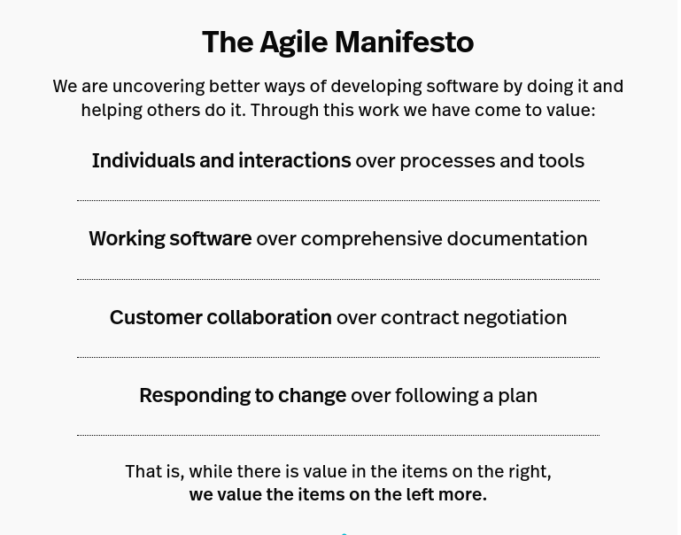

# Agile Manifesto

Twenty years ago, 17 software developers came together in Snowbird, Utah to propose a new way of developing software “by doing it and helping others do it.” Through this work, the signers of the [Agile Manifesto](https://agilemanifesto.org/) understood how much of an impact these principles would have in the field of software development—but they had no idea how quickly their ideas would spread beyond their industry. Values the Manifesto creators cited as paramount were:

### 

### Agile Principles and Values

The 12 Agile Manifesto Principles were written with a focus on software development projects. Still, today, agile has expanded far beyond product engineering, and these lessons can be applied on a grand scale within an organization to improve overall processes, management styles, and department functions.

### Key Milestones:
- **1990s**: Emergence of lightweight development methodologies like Scrum and Extreme Programming (XP).
- **2001**: Publication of the Agile Manifesto.
- **2000s**: Widespread adoption across various industries beyond software.
