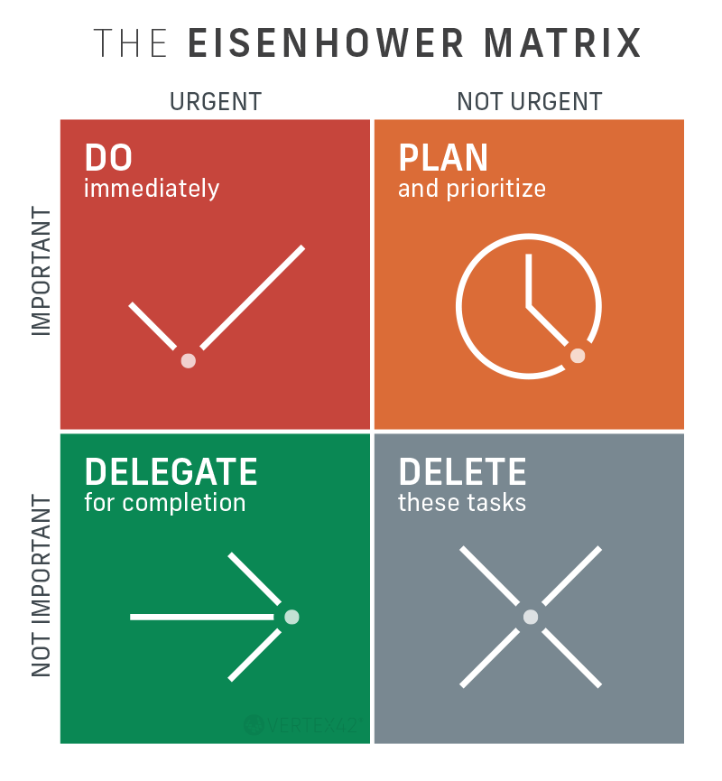
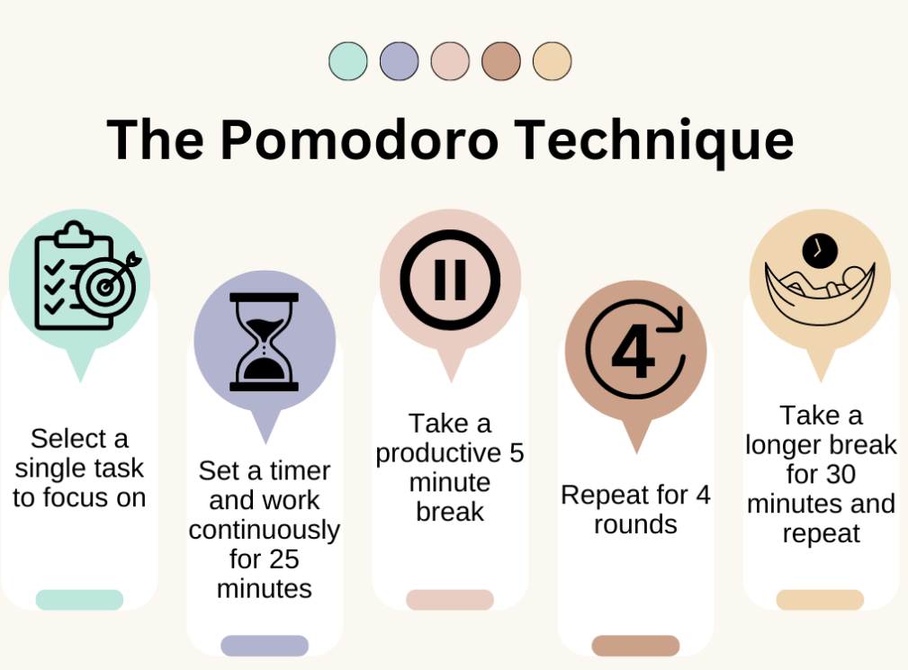
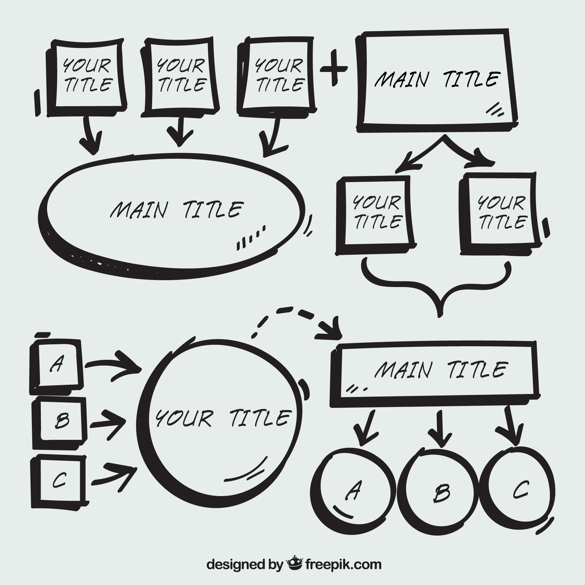
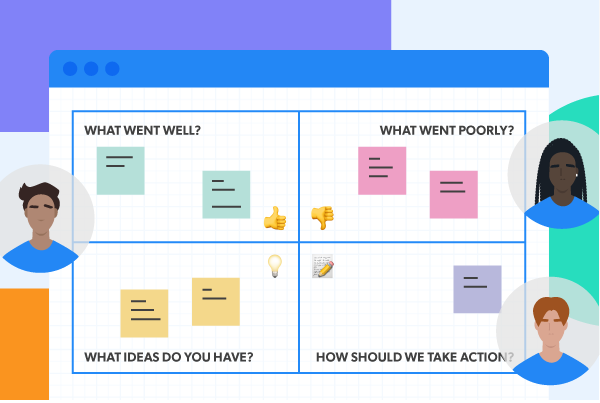

## Embracing an Agile mindset

You are now probably thinking, “Wow Agile is amazing” You are right to think this, embrace it. At its core Agile promotes flexibility, collaboration, and continuous learning. By embracing this mindset you can build products faster, adapt to changes quickly, and generate more value for your customers. In this section of the course, we will focus on applying our embraced Agile mindset.

### Learning Outcomes

- Understand and Apply Task Prioritization Techniques
- Utilize Timeboxing for Enhancement Productivity
- Develop Visual Problem-Solving Skills with Mind Mapping
- Incorporate Personal Retrospectives for Continuous Improvement

### 1. Task Prioritization

Task prioritization involves organizing tasks based on their importance and urgency. It ensures that the most critical tasks are completed first, leading to more efficient and effective work.

### *Figure 1: The Eisenhower Matrix - A tool for prioritizing tasks by urgency and importance. Adapted from the Eisenhower Decision Principle. Image Source: [Freepick](https://www.freepik.com/)*

### How to Use It:

List Tasks: Write down all the tasks you need to complete.

Prioritize: Use frameworks like the Eisenhower Matrix to categorize tasks into four quadrants:

Urgent and Important: Tasks you must do immediately.

Important but Not Urgent: Tasks you should schedule to do later.

Urgent but Not Important: Tasks you can delegate to someone else.

Neither Urgent nor Important: Tasks you can eliminate.

Review Regularly: Regularly review and adjust your task list to ensure you’re always focusing on what’s most important.

### Scheduling Focused Work Sessions:

If you find it difficult to prioritize due to a packed schedule, block off specific times in your calendar for high-priority tasks. This ensures dedicated time for critical work without interruptions.

### Why It Works

As shown in Figure 1, the Eisenhower Matrix helps categorize tasks into four quadrants based on urgency and importance. This tool allows you to focus on high-impact tasks and delegate or eliminate lower-priority ones. Prioritizing tasks helps you manage your time effectively, reduces stress, and ensures that you’re focusing on activities that provide the most value.

Template: [Eisenhower Matrix Template by Todoist](https://todoist.com/productivity-methods/eisenhower-matrix)

### 2. Timeboxing

Timeboxing is a time management technique where you allocate a fixed amount of time to a task or activity and stick to it. Once the timebox expires, you move on to the next task or take a break.

*Figure 2: The Pomodoro Technique - A timeboxing method where tasks are broken into 25-minute work intervals followed by short breaks. Image Source:*

[*Freepick*](https://www.freepik.com/)

### How to Use It:

Identify Tasks: List out the tasks you need to complete.

Set Time Limits: Assign a specific amount of time to each task. A popular method is the Pomodoro Technique, where you work for 25 minutes and then take a 5-minute break.

Use a Timer: Use a timer or a time-tracking app to keep track of your timeboxes.

Focus: During the timebox, focus solely on the task at hand without any distractions.

Review: At the end of each timebox, review what you accomplished and plan your next steps.

### Scheduling Focused Work Sessions:

If your calendar is jam-packed, consider scheduling dedicated "head-down" sections where you block off time for uninterrupted work. This can help you manage your workload and ensure you're making progress on important tasks.

### Why It Works

As illustrated in Figure 2, the Pomodoro Technique divides work into focused 25-minute sessions, followed by a 5-minute break. This approach helps maintain concentration and prevents burnout by encouraging regular breaks. Timeboxing helps maintain focus, prevents burnout, and ensures progress is made in small, manageable increments. It encourages discipline and helps you prioritize tasks effectively.

Template: [Pomodoro Technique Template by Miro](https://miro.com/miroverse/the-pomodoro-technique-template/)

### 3. Mind Mapping

What It Is: Mind mapping is a visual technique used to organize information, brainstorm ideas, and plan projects. It helps individuals and teams see connections between different concepts and break down complex tasks into manageable pieces.

*Figure 3: A Mind Map - Visualizing ideas by breaking down a central theme into related topics and subtopics. Image Source: [Freepick](https://www.freepik.com/)*

### How to Use It:

Central Idea: Start with a central idea or problem in the middle of your mind map.

Branches: Create branches from the central idea that represent main topics or tasks.

Sub-branches: Add sub-branches to break down each main topic into smaller tasks or ideas.

Visual Elements: Use colors, images, and symbols to enhance understanding and memory.

Review and Revise: Regularly review and update your mind map as new information becomes available or tasks are completed.

### Scheduling Focused Work Sessions:

Use mind maps to plan out your day or week, allocating specific time slots for each branch or task. This ensures a clear, organized approach to managing your workload.

### Why It Works:

As seen in Figure 3, mind mapping starts with a central idea and expands into various branches, each representing a topic or task. This technique helps break down complex projects into manageable pieces, making connections between ideas clearer. Mind mapping enhances creativity, improves problem-solving, and makes complex information more digestible. It helps visualize connections and ensures you don’t overlook any important details.

Template: [Mind Mapping Template by Miro](https://miro.com/templates/mind-map/)

### 4. Personal Retrospective

What It Is: A personal retrospective is a self-reflection exercise where you review your recent activities, identify successes, challenges, and areas for improvement. It helps individuals continuously improve by learning from past experiences.

*Figure 4: Personal Retrospective - A self-reflection process for continuous improvement, focusing on reviewing successes, identifying challenges, and planning actions. Image Source: [gliffy](https://www.gliffy.com/blog/retrospective-templates)*

### How to Use It:

Set a Regular Schedule: Allocate time at the end of each week or sprint for your personal retrospective.

Reflect on Achievements: Identify what went well and celebrate your successes.

Analyze Challenges: Consider what didn’t go as planned and why. Look for patterns or recurring issues.

Identify Improvements: Determine specific actions you can take to overcome challenges and improve your workflow.

Document Your Findings: Write down your reflections and action items in a journal or digital document.

Scheduling Focused Work Sessions:

Use insights from your retrospectives to plan focused work sessions. Allocate time for tasks that address identified areas for improvement.

### Why It Works:

As illustrated in Figure 4, a personal retrospective involves reflecting on past work, identifying what went well, what could be improved, and planning specific actions to make those improvements. This technique helps foster continuous growth and self-awareness. Personal retrospectives encourage self-awareness, foster continuous improvement, and help you align your actions with your goals.

Template: [Personal Retrospective Template by Miro](https://miro.com/miroverse/personal-retrospective-template/)

### References

1. [Kelly Drozd: Cultivating an agile mindset](https://www.atlassian.com/agile/advantage/agile-mindset)
2. [Taskworld: The Agile Mindset: 7 Best Practices to Achieve It](https://taskworld.com/blog/the-agile-mindset-7-best-practices-to-achieve-it/)
3. [Molly Tallbert: How to prioritize tasks in 4 steps (and get work done)](https://asana.com/resources/how-prioritize-tasks-work)
4. [Dwight D. Eisenhower:Introduction to Eisenhower Matrix,](https://www.eisenhower.me/eisenhower-matrix/)
5. [Agile Business Consortium:Timeboxing](https://www.agilebusiness.org/resource/timeboxing.html)
6. [Simplemind: Mind Mapping Basics](https://simplemind.eu/how-to-mind-map/basics/)
7. [Miro: Personal Retrospective](https://miro.com/agile/guide-to-retrospectives/)
