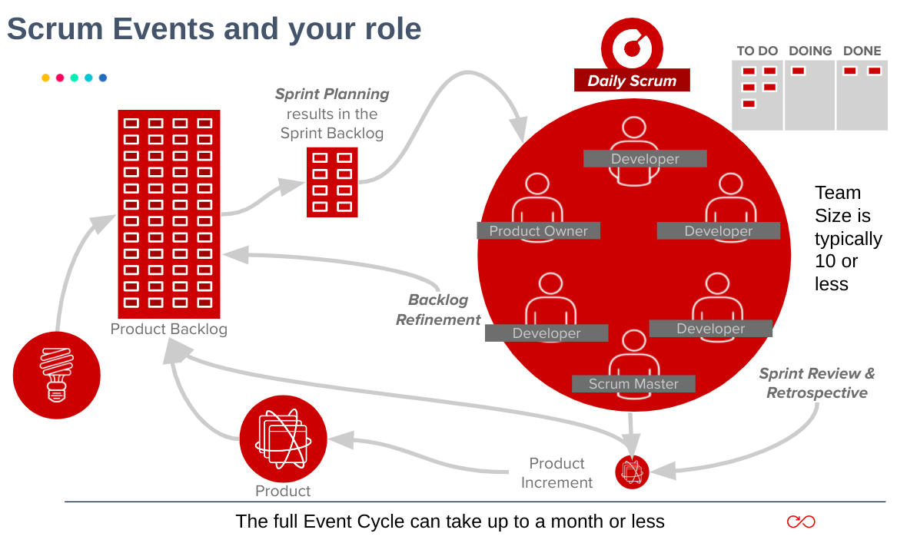

# Scrum

Scrum is a lightweight Agile framework designed to help people, teams, and organizations generate value through iterative, incremental, and adaptive solutions for complex problems. It relies on [cross-functional and self-managing teams](https://resources.scrumalliance.org/Article/scrum-team?_gl=1*1kc7ivc*_gcl_au*NzU4MjcxNjg1LjE3Mjg3NzE0NTA.*_ga*MjAwMzQzMjY5NS4xNzI4NzcxNDUw*_ga_FQREGB3E3L*MTcyOTAzMDMwOC40LjEuMTcyOTAzNjEyNy42MC4wLjA.) to deliver products and services in short cycles, enabling:

- Fast Feedback
- Quicker Innovation
- Continuous Improvement
- Rapid Adaptation to Change
- Delighted Customers
- Reduced Time From Idea to Delivery

"Scrum" comes from a 1986 Harvard Business Review article titled "[The New Product Development Game](https://hbr.org/1986/01/the-new-new-product-development-game)" by Hirotaka Takeuchi and Ikujiro Nonaka. They compared high-performing, cross-functional teams to the scrummage used by rugby teams. [Ken Schwaber and Jeff Sutherland](https://scrumguides.org/) introduced Scrum as a framework at the Object-Oriented Programming, Systems, Languages & Applications (OOPSLA) conference in 1995 in Austin, Texas.

Although Scrum has its roots in software development, it is now used across almost every industry. It allows teams to solve complex problems and deliver innovative products and services that truly delight customers. The Scrum Guide contains the official definition of Scrum.

**Before Continuing on reading, watch this [Scrum Essentials in Under 10 Minutes](https://youtu.be/RtQ3tpq-RuE?si=DaaSu3V6bPRZtmgF) video by Scrum Alliance (Jan 31, 2023).**

### In a Nutshell: Scrum Requirements

Scrum operates with the help of a Scrum Master (SM) who cultivates an environment where:

- The Product Owner (PO) organizes the work into a prioritized Product Backlog (PB).
- The Scrum Team also known as developers for simplification, selects items from the backlog and works to transform them into a valuable increment during a Sprint.
- The Scrum Team, along with stakeholders, reviews the outcome, reflects on progress, and adjusts plans for the next Sprint.
- This cycle then repeats.

Scrum is intentionally straightforward. Start by using it as designed and see how its principles, structure, and collaborative approach can drive value and help meet your goals. The framework is deliberately kept lightweight, defining only the essential elements needed to practice Scrum theory. Rather than being prescriptive, it focuses on fostering collaboration and adaptability, allowing teams to build on their own collective needs and experiences as they work.

### How it Works

*Figure 5: Scrum events infographic, created by open-source contributors*
