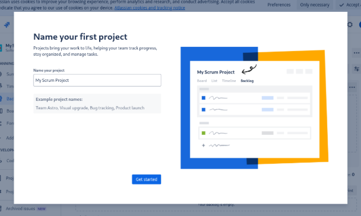
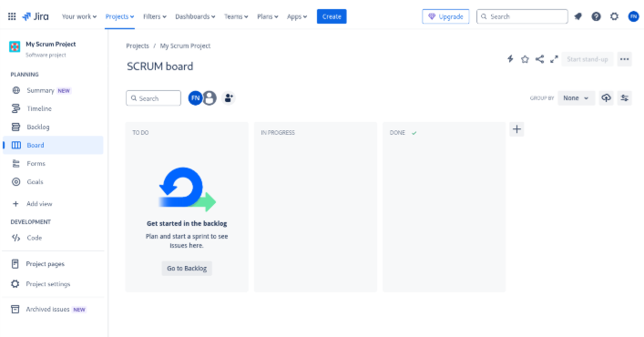

# Setting up a Jira account

### Step 1 - Create Jira Account
Navigate to https://www.atlassian.com/ and log in or Sign up for a Jira site using your personal email.

Once logged in or signed up, you will be prompted to choose or create a site, enter your site name (e.g., yourname.atlassian.com), and click continue to set up your Jira environment.

### Step 2 - Choose a template
A template is a pre-configured setup that helps you start your project quickly. Today there are two main templates for software teams:

Scrum: Ideal for teams that work in timeboxed iterations called sprints. It includes features like sprint planning, backlog refinement, and burndown charts to help manage and track progress.
Kanban: Perfect for teams that focus on continuous flow and visualizing their work. It includes features like a Kanban board, WIP (Work In Progress) limits, and cycle time tracking to optimize workflow.

In our case, we will choose Scrum because it allows us to manage our work in sprints, plan our tasks effectively, and track our progress with detailed reports. This iterative approach helps us continuously improve and adapt to changes.

### Step 3 - Configure Your Project
Enter a name for your project, for example, “My Scrum Project” and click “Get Started”.

Once you are all set up, your viewport should look similar to like this:

Great job, let us proceed to navigating Jira and understanding the interface.
