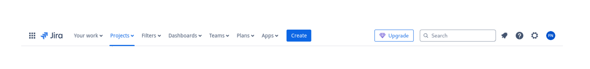
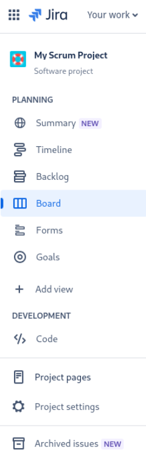
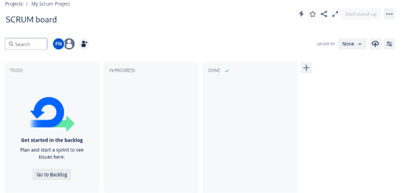

# Navigating Jira and Understanding the Interface

Welcome to Jira! Before we dive into the interactive aspects of working in Jira, let us ensure you are comfortable navigating the interface. As with any Agile tool, understanding how Jira is structured and how it fits into Agile workflows is key to using it effectively. Let us walk through the core components of Jira.

## The Header - Your Control Center

The header at the top of the screen is your quick-access control center. Here’s how it supports your Agile workflow:

- **Create Button:** Think of this as your "quick add" feature for creating tasks, user stories, bugs, or any work items your team needs to track. It’s the fastest way to add work to your backlog.

- **Search Bar:** Agile teams thrive on efficiency. Use the search bar to instantly locate issues, boards, or projects, saving you time and effort during stand-ups or planning meetings.

- **Profile and Settings (Top-Right):** Personalize your Jira experience or manage notifications here. Remember, clear communication starts with being informed, so check your notifications regularly.

- **Dashboards:** Dashboards are a game-changer for Agile teams. They provide at-a-glance visibility into sprint progress, burndown charts, and team velocity—perfect for retrospectives or stakeholder updates.

## The Sidebar - Project-Specific Navigation

In Agile, having clarity on where to find specific elements of your project is crucial. The sidebar on the left helps you access these key features:

- **Backlog:** This is your Agile backlog, a prioritized list of work items. It’s the heart of sprint planning and the source of work for your team.

- **Board:** Your Scrum board is where the magic happens. It visualizes work in progress and shows how tasks flow through different stages (e.g., To Do, In Progress, Done).

- **Project Settings:** For Agile teams working in a collaborative environment, workflows must align with your processes. Use this area to customize workflows, permissions, and notifications to suit your team’s needs.

## The Main Viewport - The Agile Workspace

The center of your screen is where you’ll spend most of your time. For Scrum teams, this is the board view, which reflects your sprint progress.

- To Do, In Progress, Done: These columns represent your team’s workflow. In Agile terms, they are your current sprint board, visualizing your commitments and progress.
- Drag-and-Drop Functionality: Moving tasks between columns simulates your daily stand-up updates—marking progress and helping the team stay aligned.

For Kanban teams, the board will reflect a continuous flow, and you can utilize features like Work In Progress (WIP) limits to ensure tasks don’t pile up, maintaining a sustainable pace.