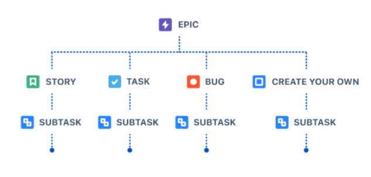

# Working with Jira

Imagine the “My Scrum Project” is an application that your team is working on to continuously deliver value to your customers. By value we mean ensuring our application works as expect. The expectations of the application will be tracked in Jira as epics broken down into issues such as stories, tasks, bugs and these issue are also broken down to ensure what ever work that needs to get done is tracked. This is known as Jira hierarchy is showcases how pieces of work ladder up to broader initiatives the image below showcases this hierarchy. 

One of our key initiatives that we will focus on while learning Jira practically is we want our application to handle User Authentication, this is additional value we want to deliver to our customers. Below we start tracking and managing this work we need a goal, our goal is
“To ensure our application provides a secure and seamless user experience by implementing robust user authentication. This includes allowing users to register, log in, and manage their accounts safely, laying the foundation for personalized app features and protecting user data”. We will refer to this goal later on for now it serves as a reminder of what we are working towards.

##### Here is the simplified data we will be using:

Epic: User Authentication
As a user, I want to register with my email and password so I can create an account.
Tasks:
- Design the User Interface for Login and Registration Pages.
    - Sub-task 1: Create wireframes for login and registration pages.
    - Sub-task 2: Implement front-end design.
    - Sub-task 3: Test the design for responsiveness.

Bugs
- The login button is unresponsive when clicked.
- Calories in the nutrition tracker do not sum correctly.

##### Creating Epics in Your Project

1. Click the blue Create button at the top of the screen.
2. In the Issue Type dropdown, select Epic.
3. Summary: Give the epic a clear, concise name. Example: User Authentication.
4. Description: Provide a more detailed explanation of the work the epic encompasses, example:

**Purpose**
Enable secure user authentication within the application, allowing users to register, log in, and manage their accounts with ease.

**Background/Feature Origin**
User authentication is a fundamental feature for any application requiring personalized user interactions. This epic focuses on creating a seamless registration and login process for the fitness app to ensure data security and enhance user experience.

**Why is this Important?**
Providing robust user authentication:
- Protects user data and builds trust.
- Serves as a foundation for implementing personalized features like progress tracking, meal plans, and notifications.
- Ensures compliance with best practices for secure application development.

