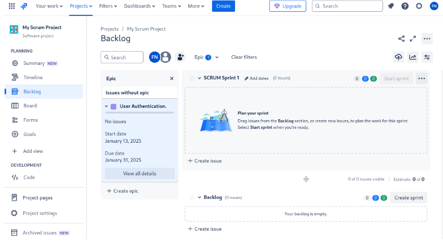
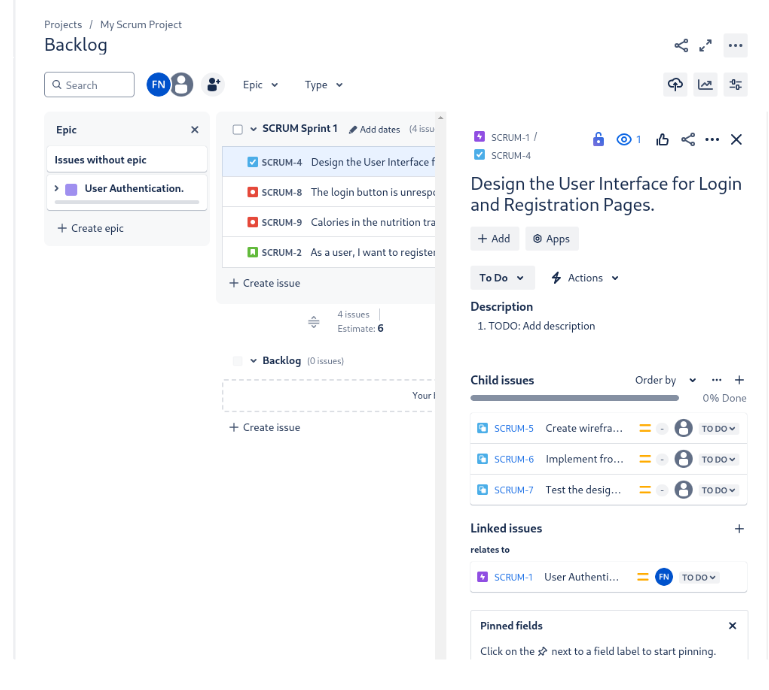
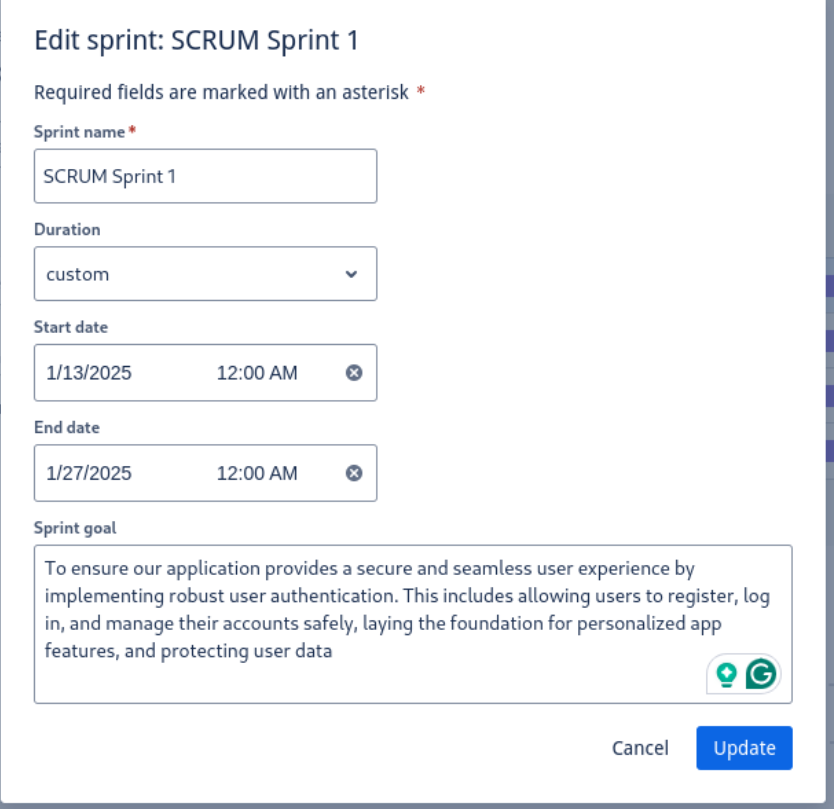
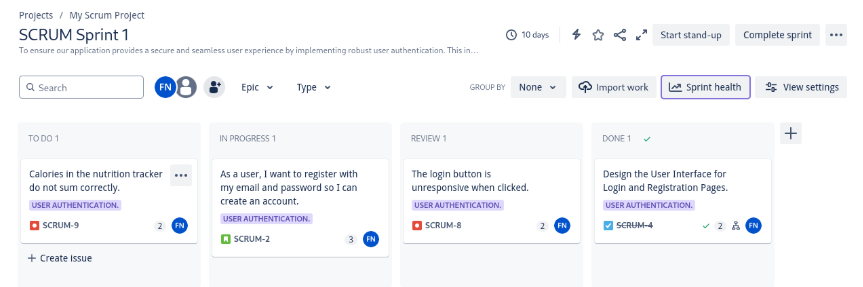
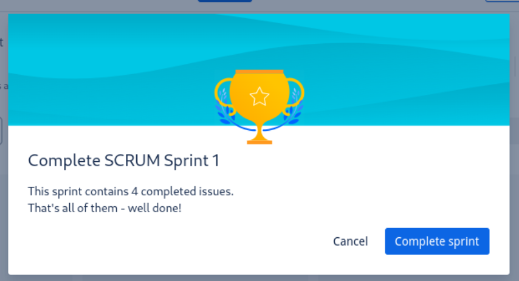
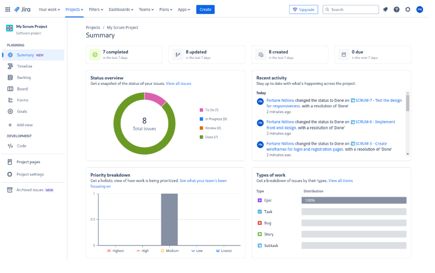

# Epics Panel
After you create your Epics, they will NOT immediately appear in the Backlog, but they will be in the Timeline viewport. You need to expand the EPIC left-hand side panel (Press the keyboard button E, to expand & collapse the Epic panel). Your viewport should look like this in the image below:

## Creating User Stories
Our epic currently has No Issues let us create issues highlighting the work that needs to be done.

1. Click the blue Create button at the top, to create a User Story
2. In the Issue Type dropdown, select Story.
3. Summary: Provide a brief description of the user story.
Example: "As a user, I want to register with my email and password so I can create an account."
4. Description (optional): Add further details or acceptance criteria if necessary.
**Example:**
- The user can enter an email and password to create an account.
- Validation ensures the email format is correct.
- A confirmation email is sent upon successful registration.
5. Parent: Link the story to the relevant epic (e.g., User Authentication).
6. Story point estimate: Add 3 story points based on its complexity and the effort required to complete it
7. Click Create to save the story.

## What are Story Points and Why do we add them

**Story points** are a way to estimate the relative effort, complexity, and risk involved in completing a user story. They are not tied to time but focus on:

- Effort: How much work is needed.
- Complexity: How challenging the work is.
- Uncertainty/Risk: How much is unknown about the work.

## Using story points helps teams:
1. Plan sprints more effectively by understanding the total capacity for a sprint.
2. Track velocity (the number of story points completed in a sprint) for future planning.
3. Avoid overloading the team by estimating effort instead of just assigning tasks.

We often use the Fibonacci sequence (1, 2, 3, 5, 8, 13, etc.) for story points because:
- It reflects the increasing uncertainty and complexity as the numbers grow larger.
- It encourages teams to focus on relative differences rather than absolute accuracy.
**For example:**
- A story with 1 point is very simple and straightforward.
- A story with 13 points is much larger, riskier, or more complex, and may need to be broken into smaller stories.

We’ve added 3 story points to our user story. In the next steps, we’ll link tasks and bugs to this story and start planning our sprint to ensure we can complete the story within the team’s capacity. This gives us a practical way to apply Agile estimation while managing work in Jira.

## Creating Tasks, Sub-Tasks, and Bugs

Next, we need to create tasks and sub-tasks related to the user story. These tasks represent the actual work needed to complete the story, and they help break it down into manageable pieces. While adding tasks and sub-tasks, we’ll also estimate their effort using story points.

It’s important to note that you typically don’t need to increase the story points for a user story after linking tasks, sub-tasks, or bugs to it. Story points are intended to represent the total effort, complexity, and risk for the entire story—not for each individual task or sub-task. The tasks and sub-tasks simply detail how the work will be carried out and are already accounted for in the story's initial estimate.

## Create Tasks and Bugs
1. Click the Create button in Jira.
2. Set the Issue Type to Task.
3. Summary: Design the User Interface for Login and Registration Pages.
4. Description: TODO: Add description
5. Parent: User Authentication.
6. Sprint: SCRUM Sprint 1
7. Story point estimate: 2
8. Reporter: yourname
9. Linked Issues to connect it to the user story: 
- Linked Issue Type: relates to
- Linked Issue: SCRUM-1
10. Save the task.

Next we want to added Sub-Tasks/Child Issue. Open the issue clicked the +Add button add clicked Child issue and add your child issues following the same outline process as above. Once you have also added the issue type bugs, your viewport look like the following image:

## Scrum Workflow
Now that our backlog is populated with all the necessary issues (stories, tasks, and bugs), the next step is to prepare for sprint planning and managing the Scrum Process. Sprint Planning is typically an event lead by the Scrum lead, where the team comes together and selects tasks they will do for the upcoming sprint. 

Within the Backlog viewport click the Add dates button and add your dates. Typically sprints run within a three week cadence depending on the feature/epic or team-based factors this can be either increased or decreased. Also add your Sprint Goal, this will serve as a reminder of what the aiming towards including helping them stay motivated. Once you are done click Update

Next, click the blue Start Sprint button to begin the sprint. You will be directed to the Board view, where you can see all the issues being worked on in the current sprint and who is assigned to them.

As work progresses, issues move through the workflow:

- TO DO -> IN PROGRESS ->  REVIEW ->  DONE
To add a REVIEW column for work that needs to be reviewed before completion:

1. Click the plus icon next to the DONE column.
2. Create a column named REVIEW and drag it to sit between IN PROGRESS and DONE.

## Tracking Progress on the Scrum Board

The Scrum board is used to track progress by moving issues across columns:
1. When work begins on an issue, move it to IN PROGRESS.
2. Once the work is completed, move it to the REVIEW column for peer or QA review.
3. After the review is complete, move it to the DONE column to mark it as finished.

## Daily Stand-Ups
During the sprint, hold daily stand-ups to discuss:
- What did you work on yesterday?
- What are you working on today?
- Are there any blockers or concerns?
These short meetings ensure everyone is aligned and any issues are addressed promptly.

## Keeping Issues Updated
It’s important to keep your issues up-to-date with your progress. Whether you're working on a task, facing a problem, or have general comments, make sure to update the comments section of the issue. This helps your team stay informed about your status and allows others to provide guidance or assistance when needed.

## Completing a Sprint
Once the sprint comes to an end, it’s time to complete the sprint and review the work that was accomplished. Completing a sprint in Jira is a straightforward process but also an important step in Agile as it sets the stage for retrospectives, planning the next sprint, and reprioritizing unfinished work.

## Steps to Complete a Sprint
1. Navigate to your Scrum Board.
2. Click the Complete Sprint button at the top right of the board.
3. Review the list of completed and incomplete issues:
- Completed Issues: These will automatically move to the DONE state.
- Incomplete Issues: Jira will ask whether you want to:
    - Move them back to the backlog for future prioritization.
    - Add them to the next sprint if one is already created.
4. Confirm the sprint completion.

## What Happens After Completing a Sprint?
Once a sprint is completed, it’s important to address any unfinished work, review the sprint’s progress, and reflect as a team to improve for the next iteration.

Any tasks, bugs, or user stories not marked as "Done" by the end of the sprint are considered incomplete and require careful evaluation. The team must determine if the unfinished work needs further refinement or updates before it can be added to the next sprint. If the work is no longer a priority, it should remain in the backlog for future consideration. These discussions take place during a Sprint Refinement session led by the Scrum Master. During this session, the team refines issues for the next sprint, ensuring that each backlog item has valid acceptance criteria, is properly estimated with story points, and is ready for development.

After completing a sprint, Jira automatically generates a Sprint Report. This report provides an overview of the sprint’s progress, including a summary of the work completed and a list of unfinished issues. It also includes insights into how the sprint progressed, which is particularly valuable during the retrospective. This data can help the team identify patterns or areas that may need attention.

## Retrospective
The sprint retrospective is an essential part of the Agile process, giving the team an opportunity to reflect on the sprint. During this meeting, the team discusses what went well, what didn’t go as planned, and how processes can be improved moving forward. The retrospective is also a time to address any blockers or challenges that were encountered during the sprint and brainstorm ways to avoid similar issues in the future.

By reviewing unfinished work, analyzing the Sprint Report, and conducting a retrospective, the team can close the sprint with actionable insights and prepare for the next one with a stronger foundation.

## Conclusion 

Congratulations! You have now completed this beginner’s guide to Jira and taken your first steps toward mastering this powerful Agile project management tool. From creating and managing projects, epics, and issues to navigating boards and tracking sprints, you’ve gained a solid foundation to manage your workflows and collaborate effectively with your team confidently.

Jira is a highly versatile tool, and the features covered in this guide are just the beginning. As you continue your Jira journey, you'll discover even more advanced capabilities, such as automation, reporting, and integrations, to further optimize your team’s productivity. Remember, the more you practice and explore, the more confident you'll become in leveraging Jira to deliver optimal value to your customers.
